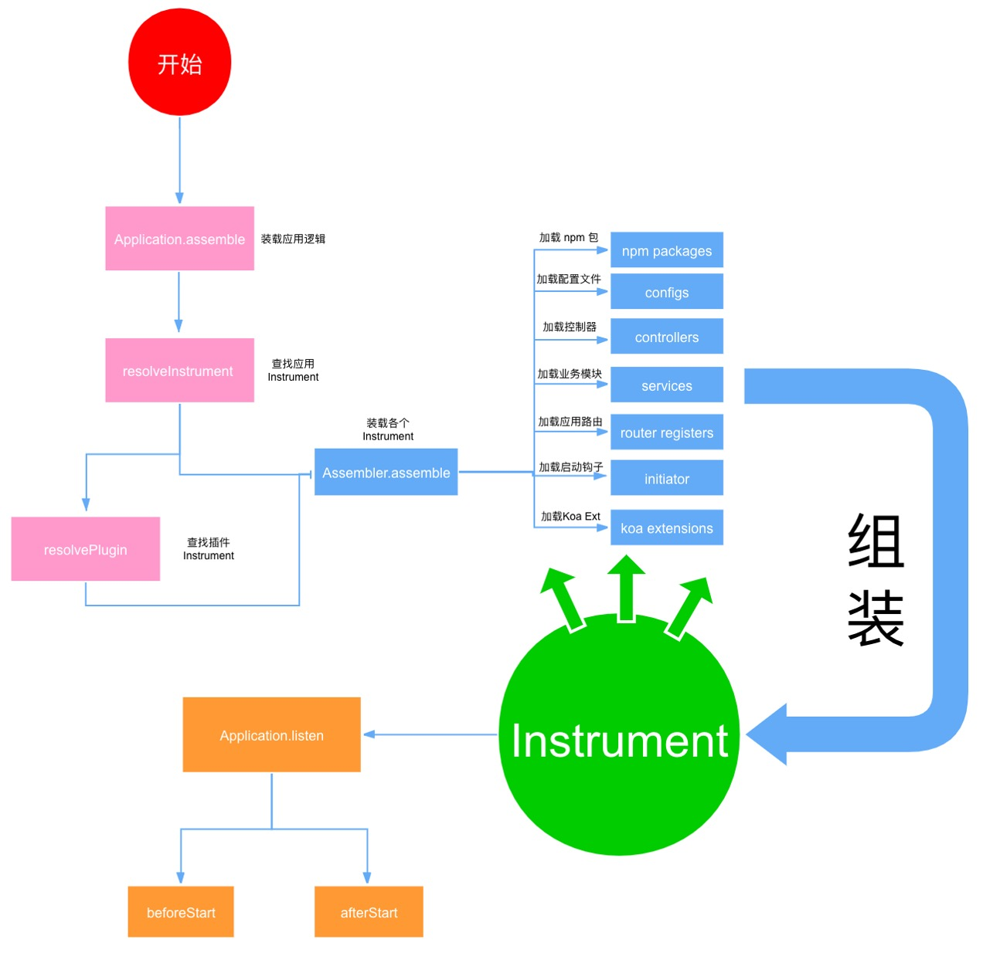

# Kukumoon
> 构建更轻便灵活的Web服务

[](#)

## Koa

> `Koa` 是一个新的 web 框架，由 `Express` 幕后的原班人马打造， 致力于成为 web 应用和 API 开发领域中的一个更小、更富有表现力、更健壮的基石。

`Koa` 和 `Express` 的设计风格非常类似，底层也都是共用的同一套 `HTTP` 基础库，但是有几个显著的区别，除了上面提到的默认异步解决方案之外，主要的特点还有下面几个。

### Middleware - 中间件

`Koa` 的中间件和 `Express` 不同，`Koa` 选择了洋葱圈模型。

中间件洋葱图：


所有的请求经过一个中间件的时候都会执行两次，对比 `Express` 形式的中间件，Koa 的模型可以非常方便的实现后置处理逻辑。

### Context - 请求上下文

和 `Express` 只有 `Request` 和 `Response` 两个对象不同，`Koa` 增加了一个 `Context` 的对象，作为这次请求的上下文对象。

> 我们可以将一次请求相关的上下文都挂载在`Context`上。

同时 `Context` 上也挂载了 `Request` 和 `Response` 两个对象。和 `Express` 类似，这两个对象都提供了大量的便捷方法辅助开发。

### Error Handler - 错误处理

通过同步方式编写异步代码带来的另外一个非常大的好处就是异常处理非常自然，使用 `try catch` 就可以将按照规范编写的代码中的所有错误都捕获到。这样我们可以很便捷的编写一个自定义的错误处理中间件。

```js
async function onerror(ctx, next) {
  try {
    await next();
  } catch (err) {
    ctx.app.coreLogger.error('error message:', err);
    ctx.body = 'server error';
    ctx.status = err.status || 500;
  }
}
```

## Kukumoon继承自Koa
  
  `Koa`非常优秀，但过于基础。`Kukumoon`在其基础上，通过一些约束使得框架更加强大和灵活。
  
### 框架设计图



### 框架原理简介
  
#### Instrument - 应用器件

`Instrument`是应用的核心，即一个可以分别在应用部分生命周期、配置项、`Controller`、`Service`、`Koa Extension`、`Koa Middleware`、`Router`、扩展更多`Instrument`等各个不同维度逐渐增加应用的能力的模块，可以理解为一个微型应用。

#### Assembler - 装载工

`Assembler`则负责提从当前`Instrument`目录中、或者所对应的`node_modules`目录中找到为`Instrument`所用的模块，并提供给`Instrument`来装载。

#### Resolver - 执行器

`Resolver`则是流转所有流程的起点，`Resolver`将从根`Instrument`开始，递归遍历查询所有可能包含的插件（也可以视作一个`Instrument`），将其加入一个栈中来供`Assembler`继续处理。